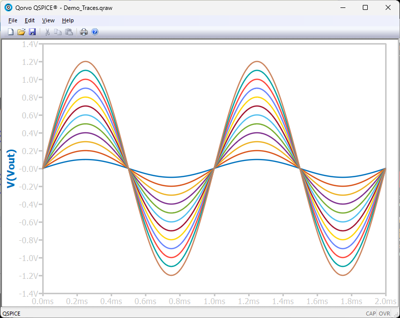
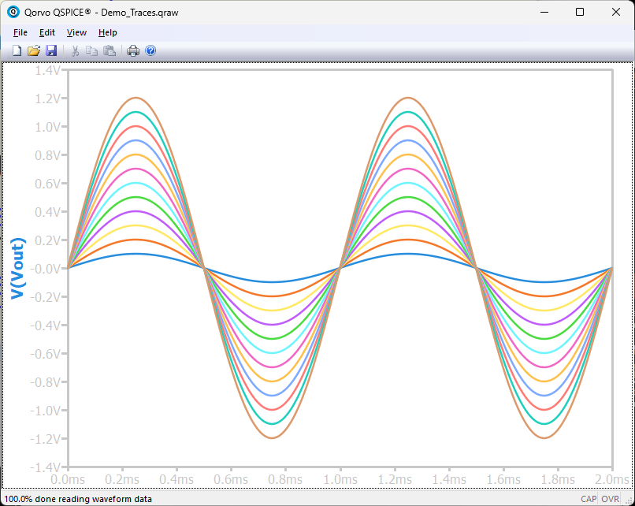
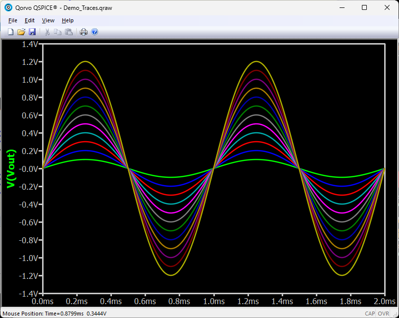
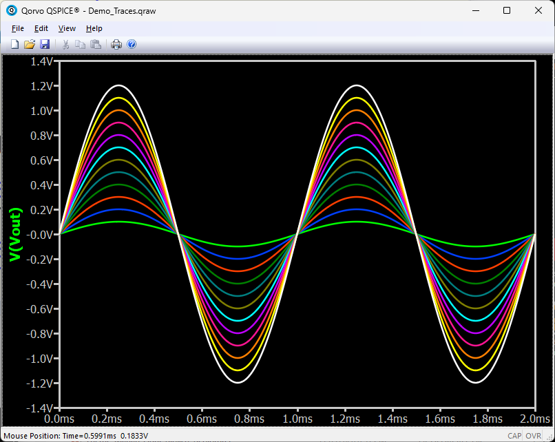

<h1> QColorPrefs</h1>

QColorPrefs is a command-line utility that lets you save, restore, and manage
your QSpice schematic and waveform color preferences. Share color themes with
colleagues, back up your settings before experiments, or maintain multiple
color schemes for different projects.

## Folders

* [Installer](./Installer/) &mdash; MSI Installer.  Installs command-line tool, documentation, and sample color themes.  Also registers the color theme file-type to install with a double-click in File Explorer and creates an initial backup of the existing QSpice color settings.
* [Binaries](./Binaries/) &mdash; Same files as the MSI Installer except the doesn't register the theme file-type for File Explorer double-click application and does not create an initial backup of existing QSpice color settings.
* [Sources](./Sources/) &mdash; Source code, MSVS project files, and developer documentation.

## Sample Color Themes
| Theme_24_R1 | Theme_24_R2 | Theme_Matlab_Light_GEM12 |
| --- | --- | --- |
|   |  | " | 

| Theme_Matlab_Light_GLOW12 | Theme_LTSpice_Dark_Default12 | Theme_QSpice_Dark_KSK12 |
| --- | --- | --- |
|  |  | |
