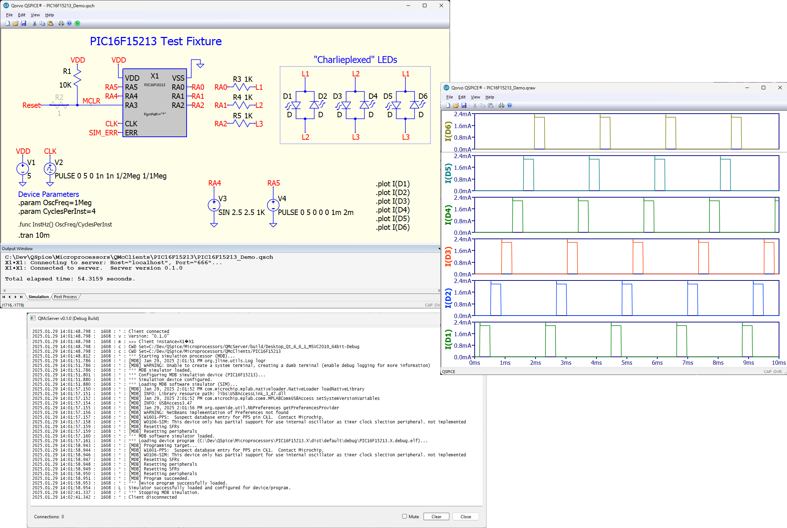

# QMcServer Project
<i>This is currently a Proof-of-Concept project.  This is early, experimental code.  The code, itself, is ~~probably~~ definitely a mess.  Documentation ~~is incomplete~~ doesn't exist at this point so you'll need to read the code....</i>

The QMcServer project is a first attempt to implement micro-controller simulation for QSpice C-Block components.  It implements Microchip products (PIC and AVR chips) through the Java-based MDB simulation API.  Currently, the code implements only the PIC16F15213 and that only partially (again, Proof-of-Concept at this point).  In theory, it can support any PIC or AVR chip to the extent that MDB supports it.

###### Note: In theory, the MDB API could even connect to a physical device through PICKit or ICE hardware.  That's not a goal for this project, just an interesting possiblility.

## The QMcServer project includes:

* A TCP-based server (QMcServer) which loads the Microchip MDB software emulator.
* QSpice component DLL code to implement the PIC16F15213 device (QMcClient) which communicates with the TCP server.
* A QSpice schematic demonstrating the PIC16F15213 chip.  This bit "flashes" three LEDs using "Charlie-Plexing" using the RA0, RA1, and RA2 tri-state GPIO pins.
* PIC16F15213 device code (*.hex, *.elf) which is loaded into the simulator and drives the GPIO pins.

## Development Requirements

If you want to play around with this early code release, well, the complete development environment is complicated.  You'll need the following:

* Qt 6.8 Open Source Edition (free) to compile the TCP server code.  Get it [here](https://www.qt.io/).
* Microsoft Visual Studio 2022 Community Edition (free) to compile the QSpice DLL code.  Get it [here](https://visualstudio.microsoft.com/downloads/).
* Microchip MPLabX IDE v6.20 to compile the PIC device code.  The installation also includes the required MDB simulator.  Get it [here](https://www.microchip.com/en-us/tools-resources/develop/mplab-x-ide).
* The Microchip MDB simulator interface requires a Java runtime environment.  See the MPLabX requirements.

## Notes

This current incarnation of the QMcServer project is pretty slow.  This is, at least in part, because the MDB simulator component is a command-line tool.  The server must parse MDB response text.  Ultimately, we'll need to rework the MDB Java code to respond with simple, easily machine-parsed text.  Or maybe create a direct C/C++ interface the to Java code.

## Volunteers Needed!!!

I'll need help along the way.  Contributors will definitely get credit...

* Initially, I could use help with some MDB modifications.  We need an interface designed for speed, not for human interaction.  I can do Java but I don't really like it.So, if you do Java and want to help, let me know.

* The component-side code is, to be kind, raw and inelegant.  I'm working on the framework to make it simple to add new micro-controller devices.  If you have ideas, let me know.

* Once the component-side framework is worked out, we'll need to add specific devices.  I'll need folk to write that code and to write device-side code (i.e., *.hex, *.elf files) and test.  Again, let me know if you're interested.

## Contact

You'll find me as @RDunn on the QSpice forums.  Send me a message if you want to contribute.

--robert

