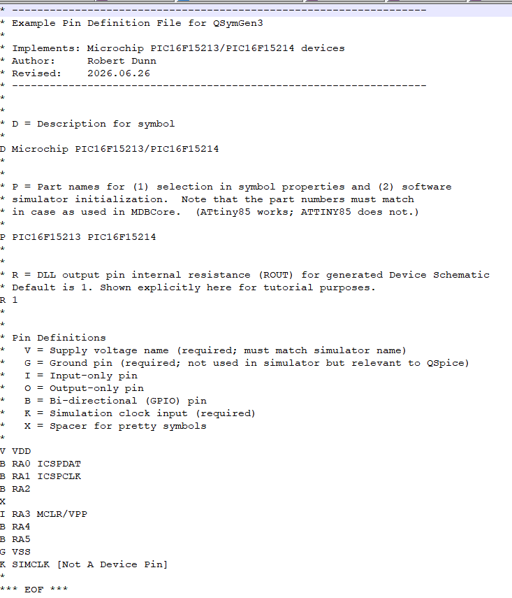
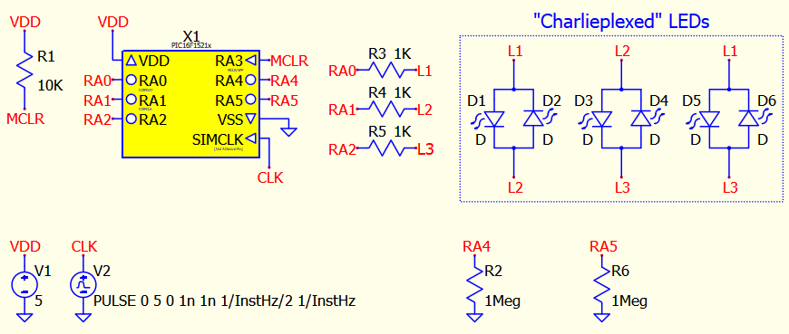
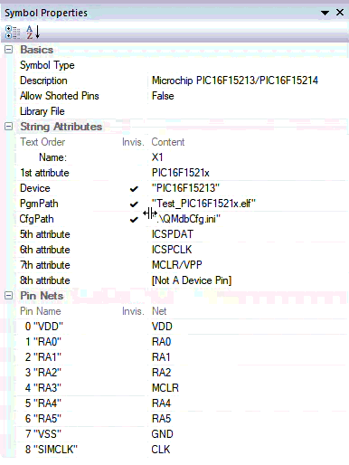
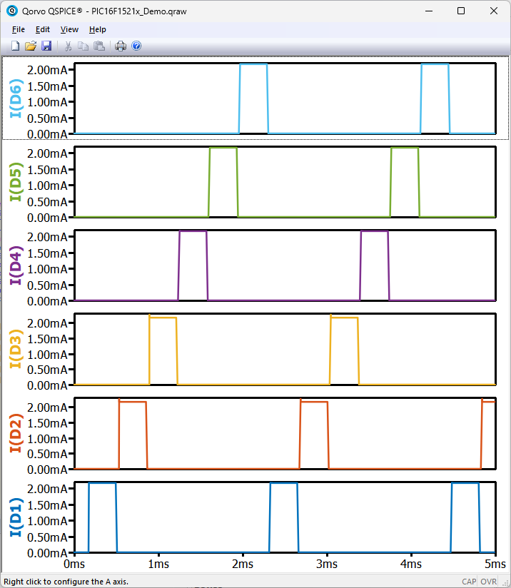

# QMdbSim2 Project

### Looking for a specific Microchip device?  [Click here](./Devices/)

-----

<table>
<tr>
<td align="center">
 
Pin Definitions
</td>
<td align="center">
 
Top-Level Schematic
</td>
<td align="center">
 
Symbol Properties
</td>
<td align="center">
 
Simulation Waveforms
</td>
</tr>
</table>

The QMdbSim2 Project is a framework for using Microchip micro-controller devices (PIC, AVR) in QSpice simulations.  It uses Microchip's software simulator so, in theory, it supports the same devices to the same extent as the simulator in MPLabX.

The project is a replacement for the earlier QMdbSim project.  Key improvements:
* QSpice simulations run much, much faster using Java Native Interface (JNI) calls to drive the Microchip Java-based simulator.
* Creating new device-specific QSpice symbols, schematics, and DLL code is now automated with the QSymGen3 command-line tool.
* A configuration file (QMdbCfg.ini) is used to locate required common tools (the Microhip MPLabX installation, a 32-bit Java installation, and the shared QMdbCS.jar).

As usual, all sources and complete documentation are included.  If you wish to compile the <nobr>C++</nobr> and Java binaries yourself, you can.  For those more trusting and less ambitious, compiled DLLs and Java JARs are provided.

## Documentation
* [Overview](QMdbSim2_Overview.pdf) &mdash; Start here.
* [Basic User](QMdbSim2_Basic_User.pdf) &mdash; Intial setup and use.
* [Device Developer](QMdbSim2_Dev_Developer.pdf) &mdash; Implementing/compiling Microchip device files.
* [API Developer](QMdbSim2_API_Developer.pdf) &mdash; Modifying/compiling the QMdbSim2 DLL/Java simulator interface.

## Folders
* [Devices](./Devices/) &mdash; Device files.
* [Basic Demo](./Basic_Demo/) &mdash; Demonstration files for Basic User PDF.
* [Developer Demo](./Developer_Demo/) &mdash; Demonstration files for Device Developer PDF.

## Contributors Needed

This project will be useful only to the extent that popular Microchip devices are supported.  If you implement a new device, please share.  I'll add your contribution to this repository and, of course, I'll be sure that you get credit.

## Contact Me

Send me a message if you have questions, suggestions, corrections, or code contributions.

You'll find me as @RDunn on [Qorvo's QSpice forum](https://forum.qorvo.com/c/qspice/).

--robert