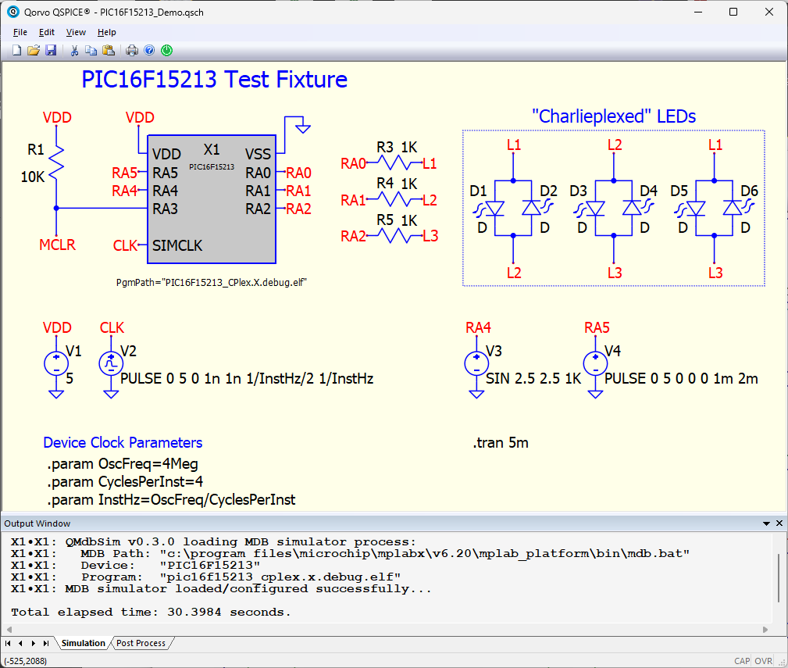
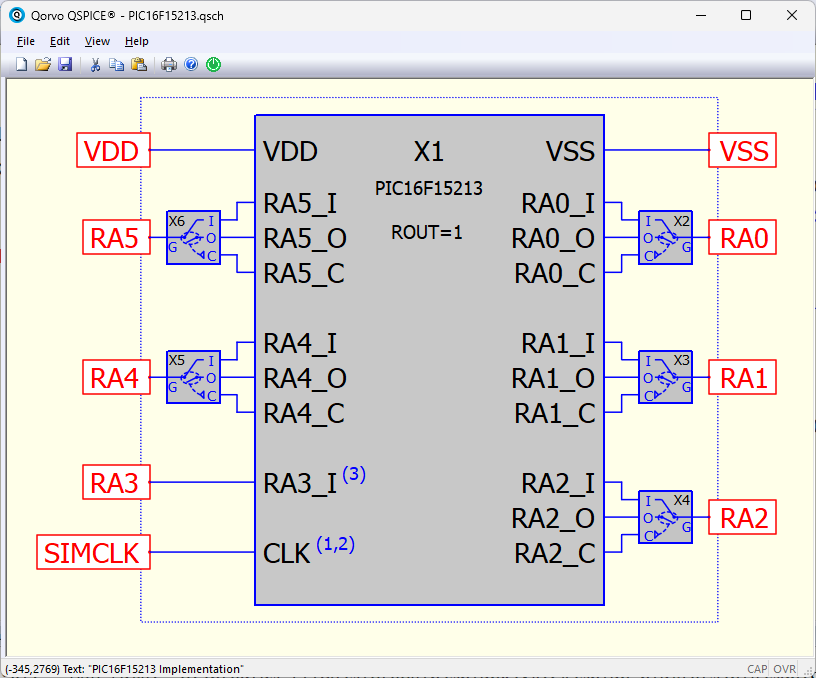
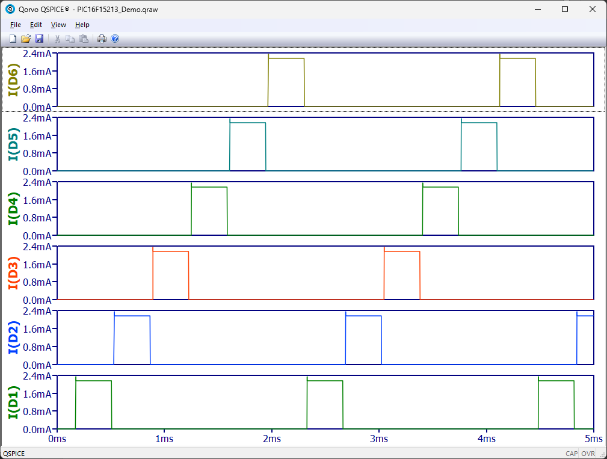

# QMdbSim Project

The QMdbSim Project is a framework for using Microchip micro-controller devices (PIC, AVR) in QSpice simulations.  It uses Microchip's software simulator so, in theory, it supports the same devices to the same extent as the simulator in MPLabX.

    
    
    

This initial release implements PIC16F15213 and ATtiny85 components.

* Compiled component DLLs are included.  You can change the PIC/AVR device code without recompiling the DLL.

* Compiled and source "Charlie-Plexing" device test code is included.

* MSVS 2022 project files are included if you need/want to recompile the DLL.  (They are pre-configured for interactive debugging with QSPICE64.exe.)

Of course, you can define other Microchip devices easily using the framework.

Basic user and developer documentation is in the [QMdbSim_Project_Doc PDF](./QMdbSim_Project_Doc.pdf).  Note that the documentation was written for the PIC16F15213 chip.  It applies equally to the ATtiny85 device.

## Core Code Revisions

The QMdbSim.cpp/.h code is shared across devices.  Once we get through the initial project shake-down, it should not change much.  At this point, I foresee a few more changes....

* 2025.02.26 - Initial release.  Core code v0.3.0.
* 2025.02.28 - Core code v0.3.1. Small change to accomodate AVR/PIC supply pin naming difference.

## Implemented Devices

* PIC16F15213 (2025.02.26)
* ATtiny85 (2025.02.28)

## Contributors Needed

This project will be useful only to the extent that popular Microchip devices are supported.  If you implement a new device, please share.  I'll add your contribution to this repository and, of course, I'll be sure that you get credit.

## A Special Plea To Java-Coders

If you're a Java-coder with a little spare time, please contact me.  The framework is slow (and potentially unreliable) due to parsing the MDB command-line stuff.  A minimal rewrite of the MDB terminal interface to simplify machine-parsing could speed things up significantly.  Even better would be the ability to call the Java API from C++ code directly.

## Contact Me

Send me a message if you have questions, suggestions, corrections, or code contributions.

You'll find me as @RDunn on [Qorvo's QSpice forum](https://forum.qorvo.com/c/qspice/).

--robert