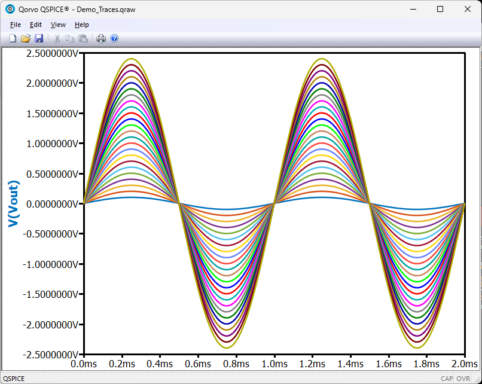
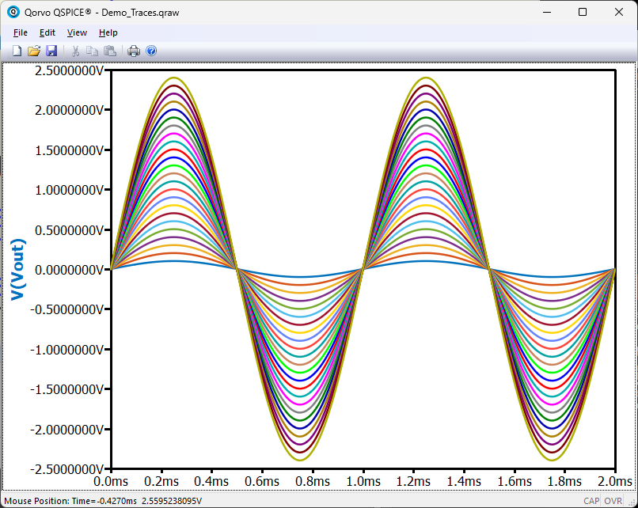

# QColorPrefs

QColorPrefs is a command-line utility that lets you save, restore, and manage
your QSpice schematic and waveform color preferences. Share color themes with
colleagues, back up your settings before experiments, or maintain multiple
color schemes for different projects.

## Folders

* [Binaries](./Binaries/) -- Pre-compiled QColorPrefs.exe, user documentation, and sample color themes.
* [Sources](./Sources/) -- Source code, MSVS project files, and developer documentation.

## Sample Light Color Themes
| Theme_24_R1 | Theme_24_R2 |
| --- | --- |
|  |  |

| Theme_Matlab_Light_GEM12 |Theme_Matlab_Light_GLOW12 |
| --- | --- |
|  |  |

## Sample Dark Color Themes
| Theme_LTSpice_Dark_Default12 | Theme_QSpice_Dark_KSK12 |
| --- | --- |
|  | |
