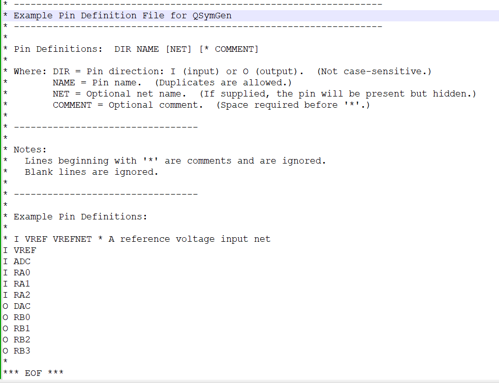

# QParser2 Project &mdash; QSymGen

| Create Pin Definitions Text File &mdash;&mdash;> | Run QSymGen &mdash;&mdash;> | Open QSpice Symbol File |
| --- | --- | --- |
|   |  |  | 

QSymGen is a command-line utility to generate a QSpice symbol (*.qsym) from a text file containing pin definitions.  It is a first step towards a much larger goal to generate symbols and DLL code that supports tri-state/GPIO pins for my micro-controller project (QMdbSym).  No GPIO pin support in this release but it does simplify generating large pin-count symbols.

## Files

* QSymGen.pdf &mdash; Basic documentation, just enough to get you started.
* QSymGen.exe &mdash; Pre-compiled stand-alone executable.  (Sources and libraries not required to run.)
* PinDefs.txt &mdash; Example pin definitions file.
* QSymGen.cpp, PinItems.cpp/.h, SymData.cpp/.h &mdash; Source code.
* QSymGen.vxproj.* &mdash; MSVS 2026 project files.

This project uses the QParser2 Project libraries (QParser2_Shared_Lib).  You will need them to compile the sources.
