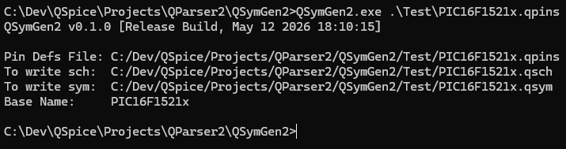
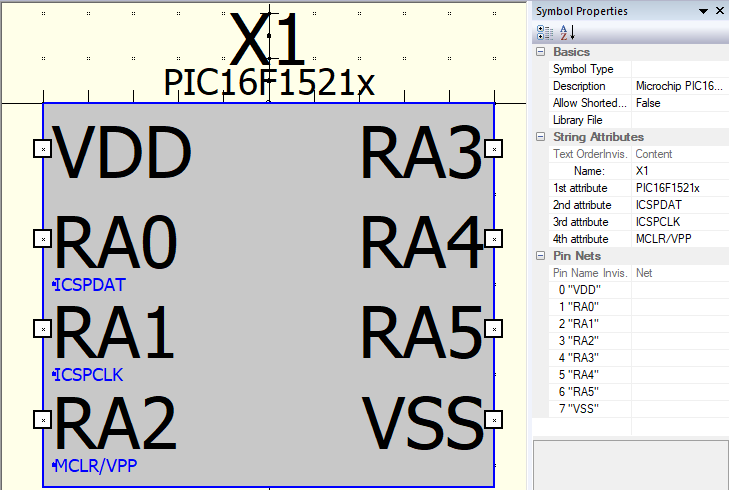
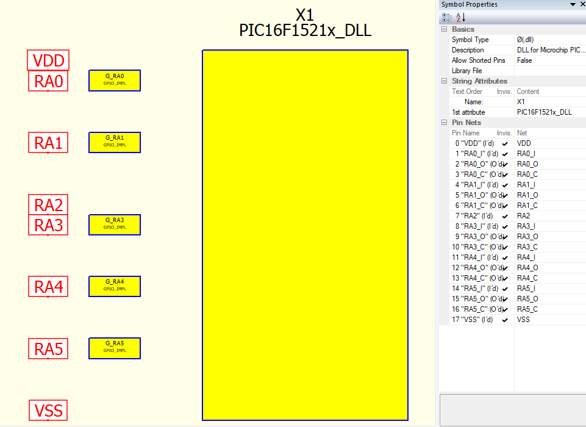
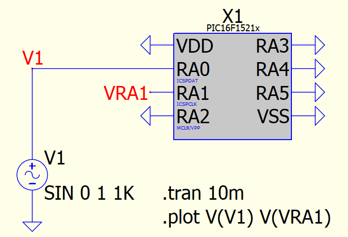

# QParser2 Project &mdash; QSymGen2

| Run QSymGen2 | Generated Symbol | Generated DLL Schematic | User-Created Schematic |
| --- | --- | --- | --- |
|   |  |  | | 

QSymGen2 is a command-line utility to generate QSpice symbol and schematic files from a text file containing micro-controller pin definitions.  The generated symbol is suitable to drop onto a schematic.  The generated schematic includes GPIO pin support and contains the C-Block for the underlying micro-controller DLL.

This project is under development and full of half-baked code and, undoubtably, incorrect comments.  There is no documentation &mdash; just source code and some insufficiently explained sample files.  More to come soon.

## Files

### Main Folder

* QSymGen2.cpp, various \*.cpp/\*.h &mdash; Source code.
* QSymGen2.vxproj.* &mdash; MSVS 2026 project files.
* QSymGen2.exe &mdash; Compiled binary.  Run without parameters to get syntax help.

### Test Subfolder

* PIC16F1521x.qpins &mdash; Pin definitions for example PIC16F15213/PIC16F15214 micro-controller.
* GPIO_IMPL.qsch &mdash; Circuit used for GPIO pin implementation.  (User can edit for a different GPIO implementation.)
* PIC16F1521x.qsym &mdash; Example symbol generated from the PIC16F1521x.qpins file.  Not intended for user editing.
* PIC16F1521x.qsch &mdash; Example DLL implementation schematic generated from the PIC16F1521x.qpins file.  Not intended for user editing.  However, user would generate the DLL template code from the DLL block in this file.
* PIC16F1521x_DLL.cpp &mdash; Example DLL implementation code for demonstration only.
* PIC16F1521x_TopLevel.qsch &mdash; Example schematic using the generated PIC16F1521x.qsym file.  Users would start with a new schematic, drop the PIC16F1521x.qsym file, and add circuitry to create their version of the micro-controller project.  This is what that might look like.

## Notes

Look carefully at generated PIC16F1521x.qsch symbol properties.  Nets are used to "wire the bits together"  which causes the DLL ports to be hidden.  This file is not intended to be edited by users.  However, creating the DLL template code starts with right-clicking the DLL block in this file.

This project uses MSVS 2026 (community version) with C++20 for the console program.

The QParser2 Project libraries (QParser2_Shared_Lib) are part of this project and required to build from the sources.
