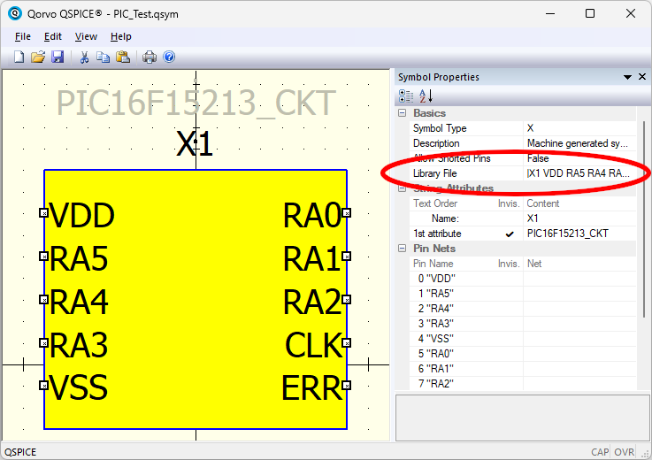
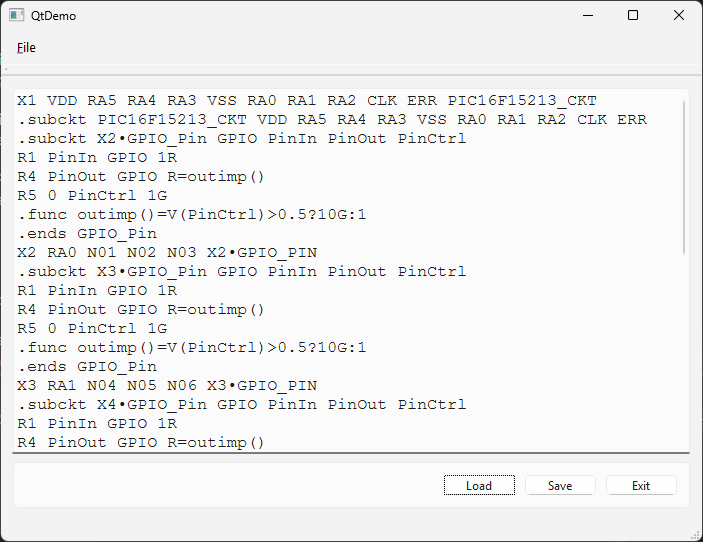

# QParser2 Project &mdash; QtDemo

| QSpice Symbol | QtDemo Viewer |
| --- | --- |
|   |  |

The QtDemo folder contains demonstration files using the Qt Framework extension in MSVS 2026 with the QParser2 shared library.

It implements a small GUI project to display the contents the "Library File" property of a QSpice symbol file in a text editor component.  It uses the QParser2 framework to load/parse the symbol.  

Note that this code is not a fully complete tool and does not contain significant error checking.  It is merely a proof of concept to get us started.  (The "tricky part" was convincing the Qt editor component to display special characters used by QSpice.)

You will need to compile the code yourself.  I have not provided an executable because, well frankly, I'm lazy.  Sharing Qt binaries requires either (1) compiling the Qt toolset source for static libraries or (2) a tedious packaging/distribution of Qt DLLs.

### Notes:

* This project uses the QParser2 Project libraries (QParser2_Shared_Lib).  You will need them to compile the sources.

* MSVS 2026.  Compile messages show the following Qt information:   Qt/MSBuild: 3.5.0.0 & Qt: 6.9.1.
